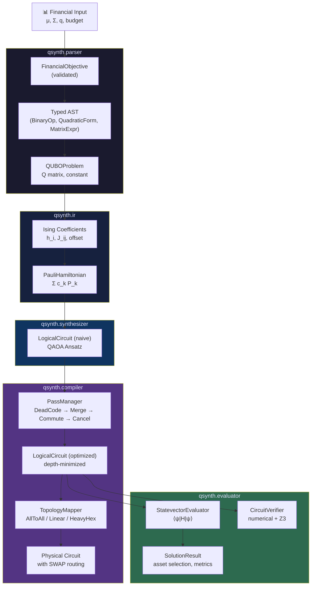

# Q-Synth: Quantum Program Synthesis for Financial Optimization

> A production-quality research compiler that automatically synthesizes depth-minimized quantum circuits from high-level financial objective functions.

---

## Abstract

Q-Synth is a rigorous, modular quantum program synthesis framework implementing a full compiler pipeline for financial optimization. Given a Markowitz Mean-Variance portfolio objective expressed in standard financial notation, Q-Synth **automatically synthesizes the most efficient quantum circuit** to solve it — without relying on black-box QAOA generators.

The synthesis follows a principled sequence of transformations:

1. A **symbolic parser** converts financial math into a typed AST.
2. An **IR layer** maps the AST to a Pauli Hamiltonian via the QUBO → Ising transformation.
3. A **synthesizer** constructs the QAOA Ansatz algorithmically from the Hamiltonian structure.
4. A **compiler** applies algebraic rewriting rules (gate cancellation, rotation merging) to minimize circuit depth.
5. An **evaluator** simulates the circuit, computes expectation values, and decodes the classical portfolio solution.

---

## Mathematical Formulation

### 1. Financial Objective (Markowitz)

$$\min_{x \in \{0,1\}^n} \quad q \cdot \frac{1}{2} x^T \Sigma x - \mu^T x$$

where:
- $x \in \{0,1\}^n$ — binary asset selection vector  
- $\mu \in \mathbb{R}^n$ — expected return vector  
- $\Sigma \in \mathbb{R}^{n \times n}$ — positive semi-definite covariance matrix  
- $q \geq 0$ — risk aversion parameter  

### 2. QUBO Reformulation

Using the binary identity $x_i^2 = x_i$, the objective is exactly equivalent to the QUBO:

$$\min_x \; x^T Q x + \text{const}$$

where $Q_{ii} = \frac{q}{2}\Sigma_{ii} - \mu_i$ and $Q_{ij} = q\Sigma_{ij}$ for $i < j$.

### 3. QUBO → Ising Mapping

Via the substitution $x_i = \frac{1 - \sigma_i^z}{2}$:

$$H_{\text{Ising}} = \sum_i h_i Z_i + \sum_{i<j} J_{ij} Z_i Z_j + \text{offset} \cdot I$$

where:
$$h_i = -\frac{1}{4} \sum_j Q_{ij}^{\text{sym}}, \quad J_{ij} = \frac{Q_{ij}^{\text{sym}}}{4}, \quad \text{offset} = \frac{\sum_{ij} Q_{ij}^{\text{sym}}}{4} + \text{const}$$

*Reference: Lucas, A. (2014). "Ising formulations of many NP problems." Frontiers in Physics, 2, 5.*

### 4. QAOA Ansatz Construction

For $p$ layers, the Ansatz is:

$$|\psi(\gamma, \beta)\rangle = \prod_{k=1}^{p} U_B(\beta_k) U_C(\gamma_k) |+\rangle^{\otimes n}$$

where:
- **Phase separator**: $U_C(\gamma) = \prod_i e^{-i\gamma h_i Z_i} \cdot \prod_{i<j} e^{-i\gamma J_{ij} Z_i Z_j}$
- **Mixer**: $U_B(\beta) = \prod_i e^{-i\beta X_i}$

The ZZ rotation is implemented as:  
$$e^{-i\gamma J_{ij} Z_i Z_j} = \text{CNOT}(i \to j) \cdot R_z(2\gamma J_{ij}) \cdot \text{CNOT}(i \to j)$$

### 5. Algebraic Optimization

The compiler applies three algebraic rewriting rules:

| Rule | Identity | Gate Reduction |
|------|----------|----------------|
| Self-inverse cancellation | $\text{CNOT} \cdot \text{CNOT} = I$ | −2 gates |
| Hadamard cancellation | $H \cdot H = I$ | −2 gates |
| Rotation merging | $R_z(a) \cdot R_z(b) = R_z(a+b)$ | −1 gate |

---

## Architecture Diagram



---

## Project Structure

```
Q-Synth/
├── pyproject.toml                    # Package metadata & dependencies
├── README.md
├── src/
│   └── qsynth/
│       ├── __init__.py
│       ├── exceptions.py             # Custom exception hierarchy
│       ├── cli.py                    # Command-line interface
│       ├── parser/
│       │   ├── __init__.py
│       │   ├── ast_nodes.py          # Typed AST nodes + Visitor interface
│       │   ├── financial_parser.py   # Markowitz objective → AST
│       │   └── qubo_builder.py       # AST → QUBO matrix (Visitor pattern)
│       ├── ir/
│       │   ├── __init__.py
│       │   ├── pauli_hamiltonian.py  # PauliTerm, PauliHamiltonian IR types
│       │   └── ising_mapper.py       # QUBO → Ising Hamiltonian mapping
│       ├── synthesizer/
│       │   ├── __init__.py
│       │   ├── gate_defs.py          # OO gate hierarchy with unitary validation
│       │   ├── logical_circuit.py    # Hardware-agnostic gate sequence
│       │   └── naive_synthesizer.py  # QAOA Ansatz construction
│       ├── compiler/
│       │   ├── __init__.py
│       │   ├── optimization_passes.py # Strategy-pattern optimization passes
│       │   └── topology.py           # Hardware topology + SWAP routing
│       └── evaluator/
│           ├── __init__.py
│           ├── statevector_evaluator.py  # Qiskit statevector simulation
│           ├── verifier.py              # Numerical + Z3 verification
│           └── solution_extractor.py    # Quantum → portfolio solution
└── tests/
    ├── conftest.py                   # Shared fixtures
    ├── test_parser.py                # Parser unit tests
    ├── test_ir.py                    # IR / Ising mapping tests
    ├── test_synthesizer.py           # Gate algebra + circuit tests
    ├── test_compiler.py              # Optimization + topology tests
    ├── test_evaluator.py             # Evaluation + verification tests
    └── test_integration.py          # End-to-end pipeline tests
```

---

## Quickstart

### 1. Installation

```bash
cd Q-Synth
pip install -e ".[dev]"
```

### 2. Run the 4-Asset Portfolio Optimization Demo

```bash
# Default: 4 assets, 1 QAOA layer, all-to-all topology
qsynth --n-assets 4 --layers 1

# 4 assets, 2 layers, linear (chain) topology
qsynth --n-assets 4 --layers 2 --topology linear

# With Z3 formal verification
qsynth --n-assets 4 --verify
```

### 3. Run Tests

```bash
# Full test suite with coverage
pytest --cov=qsynth --cov-report=term-missing

# Specific test module
pytest tests/test_compiler.py -v
```

### 4. Python API Quickstart

```python
import numpy as np
from qsynth.parser import parse_markowitz, build_qubo
from qsynth.ir import build_hamiltonian
from qsynth.synthesizer import NaiveSynthesizer
from qsynth.compiler import PassManager, HardwareTopology, TopologyMapper
from qsynth.evaluator import StatevectorEvaluator, extract_solution

# 1. Define financial inputs
mu    = np.array([0.12, 0.18, 0.09, 0.22])
sigma = np.array([
    [0.06, 0.02, 0.01, 0.03],
    [0.02, 0.09, 0.02, 0.01],
    [0.01, 0.02, 0.04, 0.01],
    [0.03, 0.01, 0.01, 0.12],
])

# 2. Parse → QUBO → Hamiltonian
objective  = parse_markowitz(mu=mu, sigma=sigma, risk_aversion=1.0,
                             asset_names=["AAPL", "GOOG", "MSFT", "AMZN"])
qubo       = build_qubo(objective)
hamiltonian = build_hamiltonian(qubo)

# 3. Synthesize naive QAOA circuit
naive_circuit = NaiveSynthesizer(n_layers=1).synthesize(hamiltonian)
print(f"Naive:     {naive_circuit.gate_count()} gates, depth={naive_circuit.depth()}")

# 4. Compile (algebraic depth reduction)
optimized = PassManager.default().run(naive_circuit)
print(f"Optimized: {optimized.gate_count()} gates, depth={optimized.depth()}")

# 5. Map to hardware topology
topo   = HardwareTopology.linear(4)
mapped = TopologyMapper(topo).map(optimized)
print(f"Linear topology: depth={mapped.depth()}")

# 6. Evaluate and decode solution
result   = StatevectorEvaluator().evaluate(optimized, hamiltonian)
solution = extract_solution(result, objective)
print(solution.describe())
```

---

## Key Design Decisions

| Concern | Approach |
|---------|----------|
| **AST traversal** | Visitor pattern — each operation is a separate `ASTVisitor` subclass |
| **Optimization passes** | Strategy pattern — `OptimizationPass` interface, composed via `PassManager` |
| **Gate representation** | OO hierarchy backed by exact unitary matrices, validated on construction |
| **Unitarity enforcement** | `_assert_unitary()` checks `‖U†U − I‖_F < tol` before gate use |
| **Sparse matrices** | `scipy.sparse.csr_matrix` used for Hamiltonian at n > 10 qubits |
| **Hardware agnosticism** | `LogicalCircuit` uses abstract qubit indices; `TopologyMapper` inserts SWAPs |
| **Formal verification** | Z3 SMT solver proves gate algebraic identities; scipy matrix exponential for circuit equivalence |

---

## Error Handling

| Exception | Trigger |
|-----------|---------|
| `InvalidCovarianceMatrixError` | Σ is not symmetric positive semi-definite |
| `InvalidReturnVectorError` | μ has wrong dimensions or q < 0 |
| `NonUnitarySynthesisError` | Gate matrix fails `‖U†U − I‖_F` check |
| `DimensionMismatchError` | Gate applied to wrong number of qubits |
| `UnsynthesizableIRError` | Hamiltonian contains non-Z Pauli terms |
| `HamiltonianConstructionError` | QUBO has higher-degree terms or structural issues |
| `TopologyError` | Circuit requires more qubits than topology, or no routing path |
| `VerificationError` | Circuit-Hamiltonian equivalence check fails |

---

## Next Steps & Research Directions

### 1. Reinforcement Learning for Synthesis Search

The current synthesizer uses a deterministic rule-based approach (QAOA Ansatz). A natural extension is to frame synthesis as a **Markov Decision Process**:

- **State**: Current partial circuit (sequence of gates applied so far)
- **Action**: Append a gate from the gate set $\{H, R_z(\theta), \text{CNOT}, \ldots\}$
- **Reward**: $-\text{circuit\_depth}$ when the target expectation value is achieved within $\varepsilon$

An RL agent (e.g., **AlphaZero-style MCTS** or **PPO**) could discover circuit structures that are shorter than the QAOA Ansatz, especially for highly structured financial Hamiltonians.

### 2. Variational Parameter Optimization

Currently gamma/beta are fixed. Adding a **classical outer loop** using `scipy.optimize.minimize` or `optax` (JAX) to optimize $(\gamma, \beta)$ would make the full QAOA functional.

### 3. Noise-Aware Compilation

Extend the compiler to use **device-native gate error rates** (from IBMQ calibration data) and route gates via the **shortest error path**, not just the shortest topological path.

### 4. Tensor Network Contraction for Simulation

For $n > 14$ qubits, replace the dense statevector with a **matrix product state (MPS)** simulator (e.g., via `quimb` or `cotengra`) to handle the exponential state space.

### 5. Higher-Order QUBO Extensions

Extend the parser to handle **polynomial objective functions** of degree > 2 using HOBO → QUBO reductions (auxiliary variable substitution), enabling non-convex financial objectives.

---

## Citation

```bibtex
@software{qsynth2025,
  title   = {Q-Synth: Quantum Program Synthesis for Financial Optimization},
  year    = {2025},
  note    = {Research prototype implementing a compiler pipeline from
             Markowitz portfolio objectives to depth-minimized QAOA circuits},
  url     = {https://github.com/your-org/Q-Synth}
}
```

---

## License

MIT License. See `LICENSE` file.
